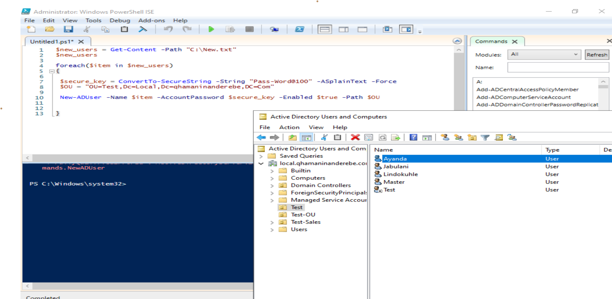

# ActiveDirectory-BulkUserCreation
PowerShell script to bulk-create Active Directory users from a text file with secure passwords and OU assignment.


# 👥 Active Directory Bulk User Creation via PowerShell

This project demonstrates how to use PowerShell to **create multiple Active Directory users** by reading from a `.txt` file. A secure password is generated, and users are assigned to a specific Organizational Unit (OU).

---

## 🔧 What This Lab Covers

- Connect to Active Directory using `Get-Credential`
- Loop through a list of usernames in a `.txt` file
- Convert a plain text password into a secure string
- Create new AD users with properties like:
  - Name
  - UPN
  - Password
  - OU path
  - Enabled status

---

### 🔹 User Creation
| Step | Description | Preview |
|------|-------------|---------|
| 1 | Creating Users From a Txt File |  |

---
## 💻 PowerShell Script Overview

```powershell
# Prompt for credentials to connect to Active Directory
$cred = Get-Credential

# Read usernames from a file
$userList = Get-Content -Path ".\\users.txt"

# Define target OU
$ouPath = "OU=TestUsers,DC=local,DC=qhamaninanderebe,DC=com"

# Loop through each username and create a user account
foreach ($user in $userList) {
    $securePass = ConvertTo-SecureString "P@ssword123" -AsPlainText -Force

    New-ADUser -Name $user `
               -SamAccountName $user `
               -UserPrincipalName "$user@local.qhamaninanderebe.com" `
               -AccountPassword $securePass `
               -Path $ouPath `
               -Enabled $true
}

⚠️ Prerequisites
Domain-joined machine

RSAT tools installed

Admin privileges in the target OU


